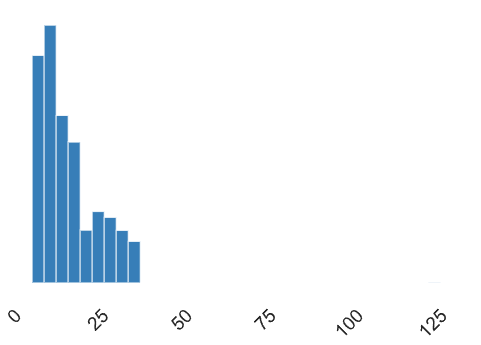
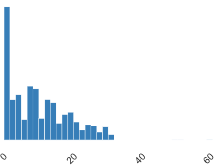

# Exploratory Data Analysis (EDA) for Customer Churn Propensity Model
## Dataset Description
These are the descriptions of the dimensions from the dataframe that was shared on Kaggle:
- <b>CustomerID</b>: Unique customer ID
- <b>Churn</b>: Churn Flag
- <b>Tenure</b>: Tenure of customer in organization
- <b>PreferredLoginDevice</b>: Preferred login device of customer
- <b>CityTier</b>: City tier
- <b>WarehouseToHome</b>: Distance in between warehouse to home of customer
- <b>PreferredPaymentMode</b>: Preferred payment method of customer
- <b>Gender</b>: Gender of customer
- <b>HourSpendOnApp</b>: Number of hours spend on mobile application or website
- <b>NumberOfDeviceRegistered</b>: Total number of deceives is registered on particular customer
- <b>PreferedOrderCat</b>: Preferred order category of customer in last month
- <b>SatisfactionScore</b>: Satisfactory score of customer on service
- <b>MaritalStatus</b>: Marital status of customer
- <b>NumberOfAddress</b>: Total number of added added on particular customer
- <b>Complain</b>: Any complaint has been raised in last month
- <b>OrderAmountHikeFromlastYear</b>: Percentage increases in order from last year
- <b>CouponUsed</b>: Total number of coupon has been used in last month
- <b>OrderCount</b>: Total number of orders has been places in last month
- <b>DaySinceLastOrder</b>: Day Since last order by customer
- <b>CashbackAmount</b>: Average cashback in last month

## Statistical notes & mathematical justifications
- Given that this dataset has a strong emphasis on categorical dimensions, I thought it best to employ Phi K ($φ_K$) correlation to assess any strong correlations that may exist between categorical and ordinal variables. This would serve as a heads up for any statistical red flags that could potentially harm the predictive accuracy of the upcoming model. Before going into that, some notes on $φ_K$ correlation and calculation of bin lengths for Interval variables.
- As stipulated by the <a href='https://arxiv.org/pdf/1811.11440'>research paper</a> $φ_K$ is an extension of the traditional Phi coefficient. The extension of this measure of correlation was designed for Machine Learning applications. Since ML/AI applications tend to deal in large and complex datasets, the 'K' aspect was designed to help understand complex high correlations between multiple categorical/ordinal variables. In so doing, help identify risky features during EDA/Feature Selection to avoid multicollinearity, amongst other gremlins that might creep into an ML/AI model.
- The <a href='https://phik.readthedocs.io/en/latest/'>Python implementation</a> of the aforementioned research paper does allow us to run a more detailed analysis that goes beyond the `y-data profiling` report. Whilst, y-data profiling claims a Phi K implementation, a closer examination of this revealed that it actually only runs a traditional <a href='https://en.wikipedia.org/wiki/Phi_coefficient'>Phi Correlation test (or the Matthews Correlation Coefficient)</a>. This only allows for the calculation of binary (categorical) categoricals but not ordinal or interval variables. The closer examination was conducted by way of attempting to cast the `SatisfactionScore` as an ordinal variable in the `df_schema` (since it's a Satisfaction Score, I would regard that as a ranked categorical variable), but y-data profiling wouldn't accept it! It was this discovery that led to deeper research into finding the correct implementation of $φ_K$ correlation.
- A critical requirement of $φ_K$ correlation lies with calculating bin lengths of the Intervals. Without correctly identifying the bin lengths of the Interval variables, it'll lead to an incorrect calculation in the $φ_K$ matrix!
- This discovery led me to research and more deeply understand how bin lengths can be dynamically calculated prior to running the $φ_K$ matrix.
- The y-data profiling report did expose how the two Interval columns `WarehouseToHome` and `Tenure` are skewed (please refer to the notes in the 'Statistical insights from the generated reports' section below). The identification of these two skewed columns meant that the bin length calculation needed to account for skewness.
- Bearing this in mind, my research led me to `Doane's Formula`. This is an extension of the simpler `Sturges' Formula` (which only takes into account the length of the data, and takes the base 2 logarithm of that length): 
$$k = 1 + \log_2(n)$$
Where: 
- $k$ represents the length of the bins 
- $n$ represents the number of observations (i.e. length of the dataset) 
### Doane's Formula: 
$$k = 1 + \log_2(n) + \log_2\left(1 + \frac{|g_1|}{\sigma_{g_1}}\right)$$
Where:  
- $n$ represents the number of observations (i.e. length of the dataset)
- $g_1$ represents the skewness and ${\sigma_{g_1}}$ represents the standard error of skewness that is denoted by:
$$\sigma_{g_1} = \sqrt{\frac{6(n-2)}{(n+1)(n+3)}}$$

## Statistical insights from the generated reports
- Despite this data containing customer ID numbers, cardinality is not present. It appears that the interactions generated by each customer may be aggregated into 1 row per ID but could represent multiple transactions with the company. I'm not sure if this is the case as the description doesn't seem to contain much detail over how this data was generated. But, I'm going to make the assumption that this is the case, and in saying that, I would assert that this is likely to harm the predictive accuracy of the upcoming model. In saying that, my research may prove me wrong!
- If we ignore the `CustomerID` column, more than half of the dimensions (10 out of 19) in the dataset are Categorical/Ordinal in nature, with the majority of them containing non-binary (but multiple) categories.
- The two Interval columns `WarehouseToHome` and `Tenure` are positively (right) skewed:
    - `WarehouseToHome`: positive (right) skewness = 1.6191537
    
    - `Tenure`: positive (right) skewness = 0.73651338  
    