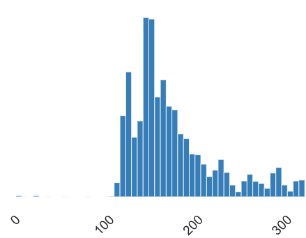
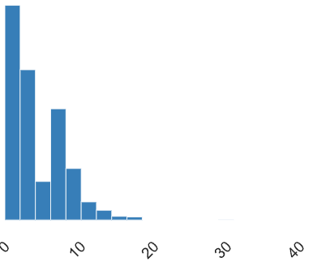
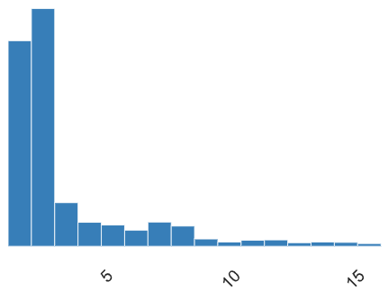

# Exploratory Data Analysis (EDA) for Customer Churn Propensity Model
## Dataset Description
These are the descriptions of the dimensions from the dataframe that was posted on <a href='https://www.kaggle.com/datasets/ankitverma2010/ecommerce-customer-churn-analysis-and-prediction'>Kaggle</a>:
- <b>CustomerID</b>: Unique customer ID
- <b>Churn</b>: Churn Flag
- <b>Tenure</b>: Tenure of customer in organization
- <b>PreferredLoginDevice</b>: Preferred login device of customer
- <b>CityTier</b>: City tier
- <b>WarehouseToHome</b>: Distance in between warehouse to home of customer
- <b>PreferredPaymentMode</b>: Preferred payment method of customer
- <b>Gender</b>: Gender of customer
- <b>HourSpendOnApp</b>: Number of hours spend on mobile application or website
- <b>NumberOfDeviceRegistered</b>: Total number of deceives is registered on particular customer
- <b>PreferedOrderCat</b>: Preferred order category of customer in last month
- <b>SatisfactionScore</b>: Satisfactory score of customer on service
- <b>MaritalStatus</b>: Marital status of customer
- <b>NumberOfAddress</b>: Total number of added added on particular customer
- <b>Complain</b>: Any complaint has been raised in last month
- <b>OrderAmountHikeFromlastYear</b>: Percentage increases in order from last year
- <b>CouponUsed</b>: Total number of coupon has been used in last month
- <b>OrderCount</b>: Total number of orders has been places in last month
- <b>DaySinceLastOrder</b>: Day Since last order by customer
- <b>CashbackAmount</b>: Average cashback in last month

## Mathematical justifications
- Given that this dataset has a strong emphasis on categorical dimensions, I thought it best to employ Phi K ($φ_K$) correlation to assess any strong correlations that may exist between categorical and ordinal variables. This would serve as a heads up for any statistical red flags that could potentially harm the predictive accuracy of the upcoming model. Before going into that, some notes on $φ_K$ correlation and calculation of bin lengths for Interval variables.
- As stipulated by the <a href='https://arxiv.org/pdf/1811.11440'>research paper</a> $φ_K$ is an extension of the traditional $φ$ coefficient. The extension of this measure of correlation was designed for Machine Learning applications. Since ML/AI applications tend to deal in large and complex datasets, the 'K' aspect was designed to help understand complex high correlations between multiple categorical/ordinal variables (not just binary categoricals). In so doing, help identify risky features during EDA/Feature Selection to avoid multicollinearity, amongst other gremlins that might creep into an ML/AI model.
- The <a href='https://phik.readthedocs.io/en/latest/'>Python implementation</a> of the aforementioned research paper does allow us to run a more detailed analysis that goes beyond the `y-data profiling` report. Whilst, y-data profiling claims a Phi K implementation, a closer examination of this revealed that it actually only runs a traditional <a href='https://en.wikipedia.org/wiki/Phi_coefficient'>Phi Correlation test (or the Matthews Correlation Coefficient)</a>. This only allows for the calculation of binary categoricals but not ordinal or interval variables (intervals are a mandatory requiremend for $φ_K$). The closer examination was conducted by way of attempting to cast the `SatisfactionScore` as an ordinal variable in the `df_schema` (since it's a Satisfaction Score, I would regard that as a ranked categorical variable), but y-data profiling wouldn't accept it! It was this discovery that led to deeper research into finding the correct implementation of $φ_K$ correlation.
- A critical requirement of $φ_K$ correlation lies with calculating bin lengths of the Intervals. Without correctly identifying the bin lengths of the Interval variables, it'll lead to an incorrect calculation in the $φ_K$ matrix!
- This discovery led me to research and more deeply understand how bin lengths can be dynamically calculated prior to running the $φ_K$ matrix.
- The y-data profiling report did expose how the 5 Interval columns `WarehouseToHome`, `CashbackAmount`, `DaySinceLastOrder`, `OrderCount`, and `Tenure` are skewed (please refer to the notes in the 'Statistical insights from the generated reports and Correlation Matrix' section below). The identification of these skewed columns meant that the bin length calculation needed to account for skewness.
- Bearing this in mind, my research led me to `Doane's Formula`. This is an extension of the simpler `Sturges's Formula` (which only takes into account the number of observations in the data, and takes the base 2 logarithm of that number): 
$$k = 1 + \log_2(n)$$
Where: 
- $k$ represents the length of the bins 
- $n$ represents the number of observations (i.e. length of the dataset) 
### Doane's Formula: 
$$k = 1 + \log_2(n) + \log_2\left(1 + \frac{|g_1|}{\sigma_{g_1}}\right)$$
Where:  
- $k$ represents the length of the bins 
- $n$ represents the number of observations (i.e. length of the dataset)
- $g_1$ represents the skewness 
- ${\sigma_{g_1}}$ represents the standard error of skewness that is denoted by:
$$\sigma_{g_1} = \sqrt{\frac{6(n-2)}{(n+1)(n+3)}}$$
- Since there doesn't appear to be a Python library to support Doane's Formula, I wrote a custom Python implementation of the above equation that can be found in the `EDA` module defined as the function `doanes_formula()`.

## Statistical insights from the generated reports and Correlation Matrix
- Despite this data containing customer ID numbers, cardinality is not present. It appears that the interactions generated by each customer may be aggregated into 1 row per ID but could represent multiple transactions with the company. I'm not sure if this is the case as the description doesn't seem to contain much detail over how this data was generated. But, I'm going to make the assumption that this is the case, and in saying that, I would assert that this is likely to harm the predictive accuracy of the upcoming model. In saying that, my research may prove me wrong!
- If we ignore the `CustomerID` column, more than half of the dimensions (10 out of 19) in the dataset are Categorical/Ordinal in nature, with the majority of them containing non-binary (but multiple) categories.
- The 5 Interval columns `WarehouseToHome`, `CashbackAmount`, `DaySinceLastOrder`, `OrderCount`, and `Tenure` are positively (right) skewed. It was the identification of this skewness that led to justifying the use of Doanne's Equation to calculate the bin lengths prior to setting the Intervals. If not for this skewness, other methods (such as Sturges's Formula) could've been considered to ascertain bin lengths:
    - `WarehouseToHome`: Positive (right) skewness = 1.6191537  
    
    - `Tenure`: Positive (right) skewness = 0.73651338  
    
    - `CashbackAmount`: Positive (right) skewness = 1.1498457  
    
    - `DaySinceLastOrder`: Positive (right) skewness = 1.1909995  
    
    - `OrderCount`: Strong positive (right) skewness = 2.1964141 
    

### Phi K ($φ_K$) correlation matrix
The identification of this skewness now leads us to the next phase of the EDA - the Phi K ($φ_K$) correlation matrix (this is attached to the repo as a CSV file `phi_k_matrix.csv`). With $φ_K$, any correlation that is >=0.5 is considered highly correlated. 
<b>N.B.:</b> Whilst, the `CustomerID` column is part of the correlation matrix (I've made a few attempts to remove it from the matrix, but `phik` library seems insistent on including it, whilst simultaneously raising a warning asking whether its an interval variable or not 🙄), it's obviously not a legitimate dimension. So, it's not included as part of the analysis.
- `CashbackAmount`: This was initially the most troublesome of the columns in the dataset due to incorrect binning as preparation for $φ_K$. It ended up generating extremely high correlation (>0.9) with <i>all</i> the other dimensions in the dataset! However, once I applied Doane's Formula to dynamically calculate the bin lengths of all skewed columns, the correlation matrix you can now see has much more reasonable looking correlation coefficients. In saying that, these are the most highly correlated features: 
&nbsp;&nbsp;- `PreferredLoginDevice`: 0.68 
&nbsp;&nbsp;- `WarehouseToHome`: 0.51 
&nbsp;&nbsp;- `PreferedOrderCat`: 0.91 
&nbsp;&nbsp;- `OrderAmountHikeFromlastYear`: 0.70 
&nbsp;&nbsp;- `OrderCount`: 0.73 
&nbsp;&nbsp;- `CouponUsed`: 0.49 
&nbsp;&nbsp; Interestingly enough, CashbackAmount is only weakly correlated with `Complain` - only 0.07. I would've expected this to be higher!
- `Tenure`: I'm going to assert that this is measured in months, since the highest value is 61. It's the most highly correlated with the following: 
&nbsp;&nbsp;- `Churn`: 0.59 
&nbsp;&nbsp;- `PreferedOrderCat`: 0.53 
- `PreferredLoginDevice`: This is most highly correlated with the following: 
&nbsp;&nbsp;- `PreferedOrderCat`: 0.74 
&nbsp;&nbsp;- `CashbackAmount`: 0.68
- `CityTier`: Only highly correlated with `PreferredPaymentMode` (0.55)
- `HourSpendOnApp`: Only highly correlated with `NumberOfDeviceRegistered` (0.53)
- `OrderAmountHikeFromlastYear`: This is most highly correlated with the following: 
&nbsp;&nbsp;- `PreferedOrderCat`: 0.60 
&nbsp;&nbsp;- `CashbackAmount`: 0.70
- `OrderCount`: This is most highly correlated with the following: 
&nbsp;&nbsp;- `CouponUsed`: 0.81 
&nbsp;&nbsp;- `PreferedOrderCat`: 0.58
- `DaySinceLastOrder`: Only highly correlated with `OrderCount` (0.50)

&nbsp;&nbsp;With the insights gained from this EDA, I would say with the upcoming model that the `CashbackAmount` feature is the one most likely to require decorrelation since multicollinearity is most present there. 
&nbsp;&nbsp;The next steps from here are to research the most appropriate algorithm/s to use for a model and to commence development of a churn propensity model.