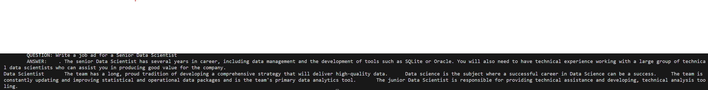

# Generative AI Language Model (POC Complete)
## Some background
My first experiment with the <a href='https://github.com/VikramsDataScience/Multi_Modal_AI_Side_Projects/tree/dev/Job_Ad_QA_Model'>`Job_Ad_QA_Model`</a> involved building a Vector Database from scratch with PyTorch. This proved successful in retrieving relevant job ads that are based on a user generated query that is parsed through the command line. However, this was only for document retrieval purposes, and was developed to return the top 5 job ads (i.e. full job ads) based on user queries. This is opposed to AI generated natural language responses to queries. Even though the search capability was quite relevant to user queries, it's primarily aimed towards document retrieval (without text generation). So it's only useful if you're looking to query your documents directly (i.e. the Retrieval aspect of a RAG), but cannot be used for text generation. So the next step was to finetune a model, based on the same SEEK job ads corpus, such that we could develop a Generative text model.

To extend on that initial foray into language models, this project was aimed at building on the foundations of that first project - by using the open sourced <a href='https://huggingface.co/openai-community/gpt2'> 'GPT-2'</a> as the base (pretrained) LLM, I performed some substantial finetuning of the model on the same job ads corpus from the first project. The result of this created a model that can generate natural language responses to user queries as they pertain to generating the content for job ads.

## Some explanations and technical details
### Pre-Processing
- The original document corpus was quite messy and was riddled with unicode and HTML tags. Whilst performing the pre-processing on the HTML tags was pretty straightforward and simply involved using BeautifulSoup's HTML Parser to identify and strip all the tags from the corpus, identifying the unicode tags proved a more tedious challenge. This involved going through chunks of the corpus to identify the most commonly occuring unicode and determining whether it needed to be removed and replaced with a 'legitimate character'. Some unicode contain accent marks for letters - for instance '\u014d' is the unicode for 'ō'. So this would mean I'd have to replace the unicode with the accented character, 'ō'. Whereas '\u2022' refers to bullet points. These could simply be stripped and not replaced by anything. 
- I should say that this pre-procesing is quite flawed as it resulted in some words being contatenated when they should be two separate words! Since I was too keen to begin my Tokenization, Finetuning, and Text Generation code development, I knowingly left these flaws in the corpus over spending excessive amounts of time trying to repair them. In a commercial environment, this would be only be acceptable for POC. Beyond POC, this flaw in the Pre-Processing code module would need to be repaired, since its polluting the corpus with incorrect n-grams, thereby negatively affecting the downstream finetuning of the model.

### Tokenization
- The tokenization module `LLM_Tokenize` is relatively straight forward since I'm using the `GPT2Tokenizer`. I think this tokenizer is actually OpenAI's `tiktoken` tokenizer in the Hugging Face backend - which is the same tokenizer that powers GPT-4 and is <a href='https://github.com/openai/tiktoken'> 'freely distributed by OpenAI'</a>. 
&nbsp;&nbsp;Here are some of the details that <i>are</i> worth elaborating:
    - I find HF's implementation to perform a train/test/validate split to be a bit weird and unintuitive. So I opted to manually split the corpus into train/validate sets and save them to storage as TXT files. From here I then use HFs `load_dataset()` method to load these TXT files such that they become compatible with the HF ecosystem and prepare them for tokenization. It's slightly convoluted, I know! But this was my solution to deal with the strange way HF perform train/validate splits. Otherwise I was getting a host of strange errors.
    - Initially I did write a function called `max_sentence_length()` that will assess the max length of the longest sentence in any given corpus. The aim of this was such that calculated value of the max length would then be fed into the tokenizer in the `encode_batches()` function. In so doing the GPT2Tokenizer would be able to incorporate this max length into the tokenizer. This proved to be very wrong indeed! What I discovered much later (after several days of painful debugging my `LLM_Finetune` module) was that the GPT2Tokenizer has a predefined `max_length=1024`. Anything character length >1024 would cause downstream problems when you call your data collator.

### Finetuning
- Without doubt the bedrock of modern day NLP implementation sits with finetuning a base model such as GPT-2 (or any of the other open sourced LLMs that are publicly available and routinely updated) against a preprocessed corpus of custom text (this would be text that's either readily available by scraping a public website or an organisations' proprietary text data). The essential idea behind finetuning is that the base model contains the weights and parameters that allow it to have an inferential Auto Regressive understanding of the English language (or any other written language if the base model supports it). When finetuned against 'documents' that contain a specific domain knowledge (in the scope of this project that was a corpus of SEEK job ads), that allows a finetuned model to be developed that can answer user queries that are specific to that domain and augmented with natural language. 
- Here's a summary of the technical details (please refer to the `LLM_Finetune` module for the code):
    - Whilst there were a total of 50,000 documents (this roughly translated to just under 100,000 rows of text) in the training set, I only used about 100 rows of this text to finetune the model. This decision was solely made on the basis of limited compute resources (I only have a 5 year old RTX2080 GPU with 8GB of VRAM). To train on even just a few thousand rows of text meant having the `LLM_Finetue` module run for several hours - let alone the full training corpus (whose time estimate was around 24+ hours)!
    - Implemented the Linear Learning Rate Warmup that's been developed by the authors of the <a href='https://arxiv.org/pdf/2402.00838.pdf'> `OLMo: Accelerating the Science of Language Models`</a> research paper. I utilised the HuggingFace Transformers library implementation of this great research paper. I had initially finetuned the model using the Linear Warmup and Linear Decay that is implemented by the `get_linear_schedule_with_warmup` method in the `transformers.optimization` class. But there is also the Linear Rate Warmup and Cosine Decay that's implemented by the `get_cosine_with_hard_restarts_schedule_with_warmup` method from the same optimization class. I've since modified my code to use this method since the decay follows a half-Cosine cycle to gradually reduce the Learning Rate as the model begins to improve its weights. As I understand it, this reduces the risk overshooting local minima as training progresses. In practice both methods are great for adjusting LRs across trainining Epochs.
    - The full training loop was developed using the Transformers library over writing the training loop in PyTorch (such as what was done in the <a href='https://github.com/VikramsDataScience/Multi_Modal_AI_Side_Projects/blob/dev/Recommender_Model/src/NCF_Model_Train/NCF_Model_Train.py'> 'NCF_Model_Train.py'</a> module for the NCF Recommender model.) This decision was made in part due to simplicity of the library's usage but more due to the amount of control that the Transformers library permits us in utilising PyTorch as a backend. In other words, the Transformers library isn't an abstracted API that takes away a developer's ability to write custom code when needed, but it's a library that allows us plenty of freedom to develop our own code when needed whilst still simplifying the model's training loop. 
    &nbsp;&nbsp;This ability to write custom code is best evidenced in the aforementioned implementation of the Linear Learning Rate Warmup. Implementing this research paper required writing a class that I called `LRSchedulerCallback`. This called the `TrainerCallback` as a parent class for inheritance and instantiated the already defined optimizer, scheduler, num_training_steps, num_eval_steps, etc. in the `on_step_end()` method. These custom definitions could then be called back into the `Trainer()` using the `trainer.add_callback()` method prior to setting the Trainer into the train mode. So the Hugging Face API does allow us quite a good deal of freedom to write custom code!

### Text Generation (two implementations)
The most exciting and satisfying aspect of developing this model was, even though the finetuning was conducted on such a tiny corpus of only around 100 rows of text, the model still managed to generate pretty okay results (please refer to the two sample screenshots below for the HuggingFace and LangChain implementations). In the screenshots you can see there are definite flaws in the text generation, but considering the tiny training set, I would say these are very good results. I think that with sufficient compute resources to enable a full training run, and also some additional pre-processing to clean up some of the issues that were discussed in the Pre-Processing section, this model should then perform quite well! 
- <b>HuggingFace</b>: This is a screenshot of the HF implementation:

- <b>LangChain</b>: And this is a screenshot of the LangChain implementation:

- In terms of technical notes, I've included the same docstring from the `generate_text()` function that's contained in the `LLM_Generate` module:
    - <b>Temperature</b>: Modify the 'temperature' arg to stipulate the stochasticity of the model's generated response by 
    adjusting the value of the applied Softmax layer from the converted logit (i.e. higher temperature will make the 
    model's response less deterministic). This arg can be used in conjunction with 'top_k' as a scaling method to 
    temper the number of top_k n-grams that are part of the sampling scheme. However, experimentation has shown that
    'top_p' can be a better choice and temperature doesn't have to be used at all.
    - <b>Top-K</b>: In Top-K sampling, the K most likely next words are filtered and the probability mass is 
    redistributed among only those K next words.
    - <b>Top-p</b>: The 'nucleus' sampling method works by sampling only from the most likely K words. Top-p sampling 
    chooses from the smallest possible set of words whose cumulative probability exceeds the probability p.
    - <b>No repeat ngram size</b>: The most common n-grams penalty makes sure that no n-gram appears twice by manually setting the probability 
    of next words that could create an already seen n-gram to 0. In other words, if probability reaches 0 we won't see any repetition of the same word twice.
    - I had also set the 'max_new_tokens=200'. This seemed to be maximum that the generate method would allow. Any increases to this amount seemed to cause the model to generate gibberish text.

### RAG (Retrieval Augmented Generation) as an alternative to finetuning (EXPERIMENTAL AND NOT COMPLETE)
- <b>Pinecone Vector Database</b>: I've developed an additional code module called `LLM_RAG_Doc_Upsert` that is intended to upsert (update/insert) documents into Pinecone's Vector DB. I've had some implementation issues with this module, so far. And since the finetuned model has worked surprisingly well I wanted to park this module's development for now and move to a new project. If time permits, I may return to this at some point in the future.