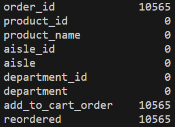

# Shopping Cart Recommender Model (WIP)
This project is a recommender model based on ecommerce orders data (including whether certain products were reordered).

# EDA
## On Missing Values
The `ProfileReport` seemingly exposes about 10,565 missing values from the dataset. However, the missing values appear to be visits to particular product pages, but where no orders were made:

We can see that there are missing rows in the columns `'order_id'`, `'add_to_cart_order'`, and `'reordered'` - all of these columns appear to relate to orders placed. Being as this is a recommender, I felt it would be prudent to keep these rows, since they contain important information on how users are navigating the site.

